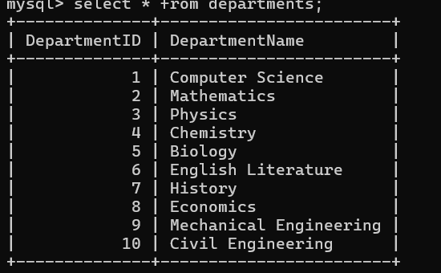
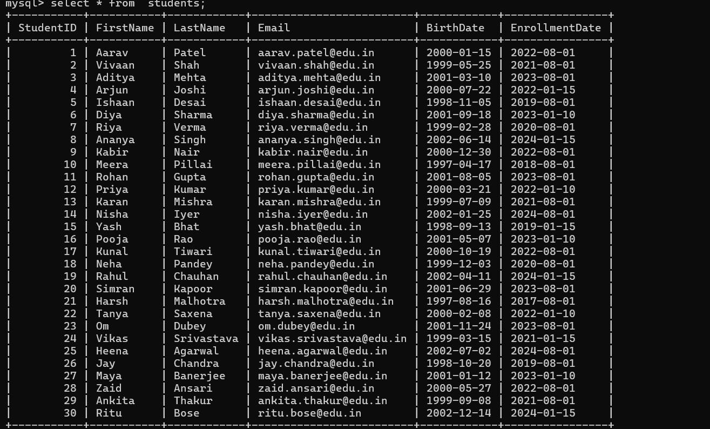
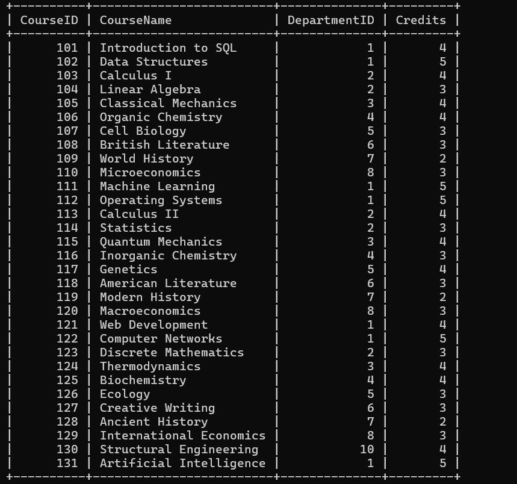
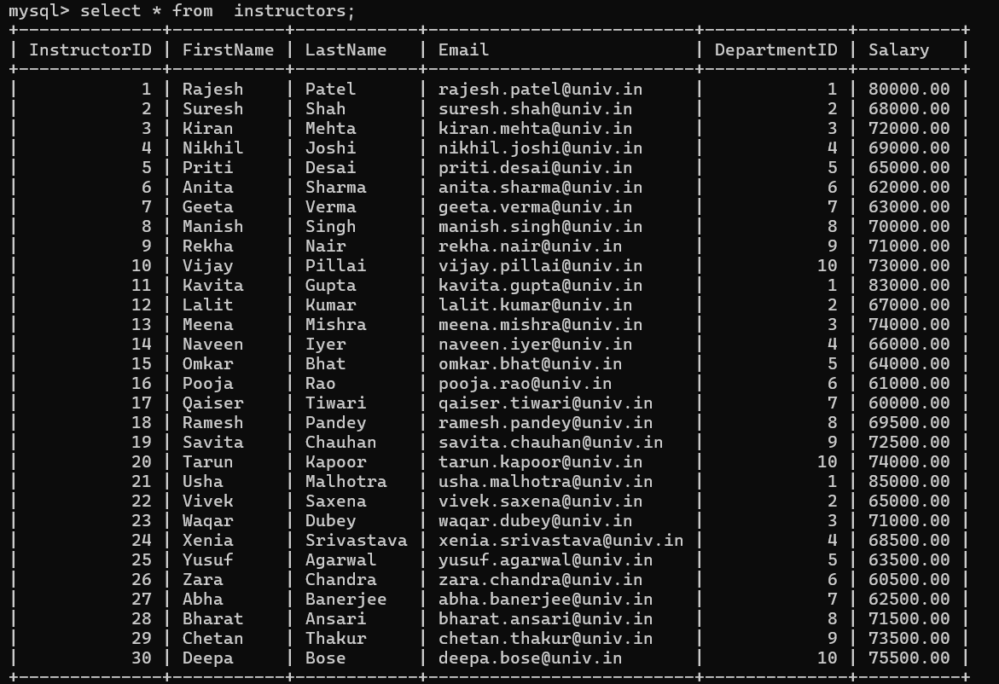
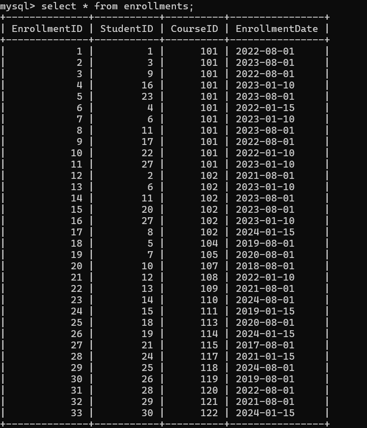

# 🎓 Indian University Course Management System

A relational database project built with **MySQL** that models a university's academic operations — managing students, instructors, courses, departments, and enrollments. The project covers full database design, sample data insertion, CRUD operations, and 15+ analytical SQL queries.

---

## 📁 Repository Structure

```
📦 University-Course-Management-System
 ├── 📄 README.md
 ├── 📄 University_Course_Management_System.sql
 └── 📂 Tables
      ├── 🖼️ Department_Table.png
      ├── 🖼️ Students_Table.png
      ├── 🖼️ Course_Table.png
      ├── 🖼️ Instructors_Table.png
      └── 🖼️ Enrollments_Table.png
```

---

## 🗄️ Database

**Database Name:** `IndianUniversityCMS`

---

## 🗂️ Table Structure

The database consists of **5 tables** with the following schema:

### 1. Departments
| Column | Type | Constraint |
|--------|------|------------|
| DepartmentID | INT | PRIMARY KEY |
| DepartmentName | VARCHAR(100) | NOT NULL |

### 2. Students
| Column | Type | Constraint |
|--------|------|------------|
| StudentID | INT | PRIMARY KEY, AUTO_INCREMENT |
| FirstName | VARCHAR(50) | NOT NULL |
| LastName | VARCHAR(50) | NOT NULL |
| Email | VARCHAR(100) | UNIQUE, NOT NULL |
| BirthDate | DATE | NOT NULL |
| EnrollmentDate | DATE | NOT NULL |

### 3. Courses
| Column | Type | Constraint |
|--------|------|------------|
| CourseID | INT | PRIMARY KEY, AUTO_INCREMENT |
| CourseName | VARCHAR(100) | NOT NULL |
| DepartmentID | INT | FK → Departments |
| Credits | INT | NOT NULL |

### 4. Instructors
| Column | Type | Constraint |
|--------|------|------------|
| InstructorID | INT | PRIMARY KEY, AUTO_INCREMENT |
| FirstName | VARCHAR(50) | NOT NULL |
| LastName | VARCHAR(50) | NOT NULL |
| Email | VARCHAR(100) | UNIQUE, NOT NULL |
| DepartmentID | INT | FK → Departments |
| Salary | DECIMAL(10,2) | NOT NULL, DEFAULT 50000.00 |

### 5. Enrollments
| Column | Type | Constraint |
|--------|------|------------|
| EnrollmentID | INT | PRIMARY KEY, AUTO_INCREMENT |
| StudentID | INT | FK → Students |
| CourseID | INT | FK → Courses |
| EnrollmentDate | DATE | NOT NULL |

---

## 🔗 Entity Relationship Overview

```
Departments ──< Courses ──< Enrollments >── Students
Departments ──< Instructors
```

- One **Department** has many **Courses** and many **Instructors**
- One **Course** can have many **Enrollments**
- One **Student** can have many **Enrollments** (many-to-many with Courses via Enrollments)

---

## 📊 Sample Data — Table Snapshots

### 🏛️ Departments Table


---

### 🎓 Students Table


---

### 📚 Courses Table


---

### 👨‍🏫 Instructors Table


---

### 📋 Enrollments Table


---

## ⚙️ Sample Data Summary

| Table | Rows |
|-------|------|
| Departments | 10 |
| Students | 30 |
| Courses | 31 (30 base + 1 via CRUD demo) |
| Instructors | 30 |
| Enrollments | 33 |

**Departments covered:** Computer Science, Mathematics, Physics, Chemistry, Biology, English Literature, History, Economics, Mechanical Engineering, Civil Engineering

---

## 🛠️ CRUD Operations (Query 1)

### ➕ CREATE
```sql
-- Add a new student
INSERT INTO Students (StudentID, FirstName, LastName, Email, BirthDate, EnrollmentDate)
VALUES (31, 'New', 'Student', 'new.student@edu.in', '2003-01-01', '2025-08-01');

-- Add a new course
INSERT INTO Courses (CourseID, CourseName, DepartmentID, Credits)
VALUES (131, 'Artificial Intelligence', 1, 4);
```

### 📖 READ
```sql
SELECT * FROM Students;
SELECT * FROM Courses;
SELECT * FROM Instructors;
SELECT * FROM Enrollments;
SELECT * FROM Departments;
```

### ✏️ UPDATE (Increment & Decrement)
```sql
-- INCREMENT: Increase credits by 1 for all Computer Science courses
UPDATE Courses SET Credits = Credits + 1 WHERE DepartmentID = 1;

-- DECREMENT: Reduce credits by 1 for History courses
UPDATE Courses SET Credits = Credits - 1 WHERE DepartmentID = 7;

-- INCREMENT: Give all CS instructors a $5000 salary raise
UPDATE Instructors SET Salary = Salary + 5000 WHERE DepartmentID = 1;

-- DECREMENT: Reduce salary of instructors earning above $80000 by $2000
UPDATE Instructors SET Salary = Salary - 2000 WHERE Salary > 80000;
```

### 🗑️ DELETE
```sql
-- Remove the newly added test student
DELETE FROM Students WHERE StudentID = 31;
```

---

## 🔍 SQL Queries (Query 2 – Query 16)

### Query 2 — Students Enrolled After 2022
```sql
SELECT StudentID, FirstName, LastName, EnrollmentDate
FROM Students
WHERE EnrollmentDate > '2022-12-31'
ORDER BY EnrollmentDate;
```

---

### Query 3 — Mathematics Courses (Limit 5)
```sql
SELECT CourseID, CourseName, Credits
FROM Courses
WHERE DepartmentID = 2
ORDER BY CourseID
LIMIT 5;
```

---

### Query 4 — Courses With More Than 5 Students
```sql
SELECT c.CourseID, c.CourseName, COUNT(e.StudentID) AS TotalStudents
FROM Courses c
JOIN Enrollments e ON c.CourseID = e.CourseID
GROUP BY c.CourseID, c.CourseName
HAVING COUNT(e.StudentID) > 5
ORDER BY TotalStudents DESC;
```

---

### Query 5 — Students Enrolled in BOTH Course 101 AND 102 (INTERSECT via JOIN)
```sql
SELECT s.StudentID, s.FirstName, s.LastName
FROM Students s
JOIN Enrollments e1 ON s.StudentID = e1.StudentID AND e1.CourseID = 101
JOIN Enrollments e2 ON s.StudentID = e2.StudentID AND e2.CourseID = 102;
```

---

### Query 6 — Students Enrolled in EITHER Course 101 OR 102 (UNION)
```sql
SELECT s.StudentID, s.FirstName, s.LastName, 'Intro to SQL' AS CourseName
FROM Students s
JOIN Enrollments e ON s.StudentID = e.StudentID
WHERE e.CourseID = 101

UNION

SELECT s.StudentID, s.FirstName, s.LastName, 'Data Structures' AS CourseName
FROM Students s
JOIN Enrollments e ON s.StudentID = e.StudentID
WHERE e.CourseID = 102
ORDER BY StudentID;
```

---

### Query 7 — Average Credits Across All Courses
```sql
SELECT AVG(Credits) AS AverageCredits
FROM Courses;
```

---

### Query 8 — Maximum Instructor Salary in Computer Science
```sql
SELECT MAX(Salary) AS MaxSalary
FROM Instructors
WHERE DepartmentID = 1;
```

---

### Query 9 — Student Count per Department
```sql
SELECT d.DepartmentName, COUNT(DISTINCT e.StudentID) AS StudentCount
FROM Departments d
JOIN Courses     c ON d.DepartmentID = c.DepartmentID
JOIN Enrollments e ON c.CourseID     = e.CourseID
GROUP BY d.DepartmentID, d.DepartmentName
ORDER BY StudentCount DESC;
```

---

### Query 10 — INNER JOIN: Students With Their Courses
```sql
SELECT s.StudentID, s.FirstName, s.LastName, c.CourseName, e.EnrollmentDate
FROM Students s
INNER JOIN Enrollments e ON s.StudentID = e.StudentID
INNER JOIN Courses     c ON e.CourseID  = c.CourseID
ORDER BY s.StudentID;
```

---

### Query 11 — LEFT JOIN: All Students + Courses (Including Unenrolled)
```sql
SELECT s.StudentID, s.FirstName, s.LastName, c.CourseName
FROM Students s
LEFT JOIN Enrollments e ON s.StudentID = e.StudentID
LEFT JOIN Courses     c ON e.CourseID  = c.CourseID
ORDER BY s.StudentID;
```

---

### Query 12 — Subquery: Students in Courses With More Than 10 Enrollments
```sql
SELECT StudentID, FirstName, LastName
FROM Students
WHERE StudentID IN (
    SELECT e.StudentID
    FROM Enrollments e
    WHERE e.CourseID IN (
        SELECT CourseID
        FROM Enrollments
        GROUP BY CourseID
        HAVING COUNT(StudentID) > 10
    )
);
```

---

### Query 13 — Extract Enrollment Year
```sql
SELECT StudentID, FirstName, LastName, EnrollmentDate,
       YEAR(EnrollmentDate) AS EnrollmentYear
FROM Students
ORDER BY EnrollmentYear;
```

---

### Query 14 — Concatenate Instructor Full Name
```sql
SELECT InstructorID,
       CONCAT(FirstName, ' ', LastName) AS FullName,
       Email, DepartmentID
FROM Instructors
ORDER BY InstructorID;
```

---

### Query 15 — Running Total of Enrolled Students (Window Function)
```sql
SELECT e.EnrollmentID, e.CourseID, c.CourseName, e.StudentID, e.EnrollmentDate,
       SUM(1) OVER (ORDER BY e.EnrollmentID) AS RunningTotalStudents
FROM Enrollments e
JOIN Courses c ON e.CourseID = c.CourseID
ORDER BY e.EnrollmentID;
```

---

### Query 16 — Label Students as Senior or Junior (CASE)
```sql
SELECT StudentID, FirstName, LastName, EnrollmentDate,
    CASE
        WHEN DATEDIFF(CURDATE(), EnrollmentDate) > (4 * 365) THEN 'Senior'
        ELSE 'Junior'
    END AS StudentLevel
FROM Students
ORDER BY StudentID;
```

---

## 🚀 How to Run

1. Make sure **MySQL** is installed and running on your machine.
2. Open your MySQL client (MySQL Workbench, DBeaver, or terminal).
3. Run the SQL file:
   ```bash
   mysql -u root -p < University_Course_Management_System.sql
   ```
   Or paste the file contents directly into your MySQL client and execute.
4. The database `IndianUniversityCMS` will be created automatically.
5. Run any of the queries from Step 4 onwards to explore the data.

---

## 🧰 Tech Stack


---

## 📌 Key SQL Concepts Covered

| Concept | Queries |
|---------|---------|
| DDL — CREATE TABLE | Step 2 |
| DML — INSERT, UPDATE, DELETE | Step 3 & 4 |
| WHERE, ORDER BY, LIMIT | Q2, Q3 |
| GROUP BY + HAVING | Q4, Q9 |
| INTERSECT (via JOIN) | Q5 |
| UNION | Q6 |
| Aggregate Functions (AVG, MAX, COUNT) | Q7, Q8, Q9 |
| INNER JOIN | Q10 |
| LEFT JOIN | Q11 |
| Subquery (nested SELECT) | Q12 |
| Date Functions (YEAR, DATEDIFF) | Q13, Q16 |
| String Functions (CONCAT) | Q14 |
| Window Functions (SUM OVER) | Q15 |
| CASE Expression | Q16 |
